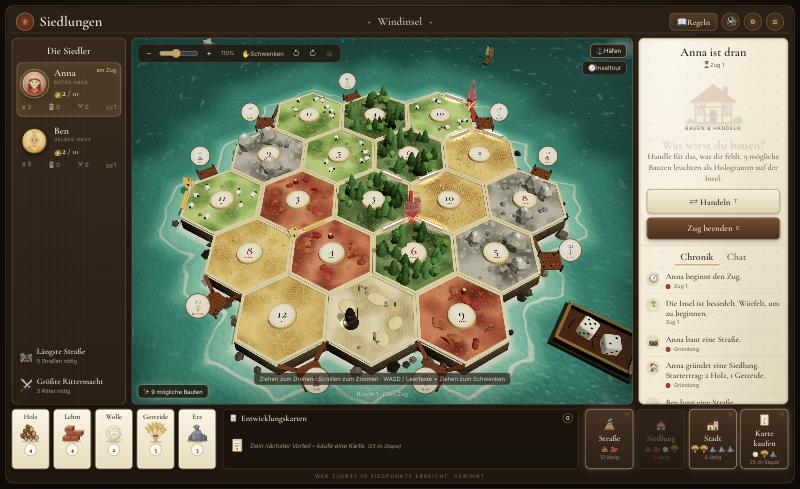
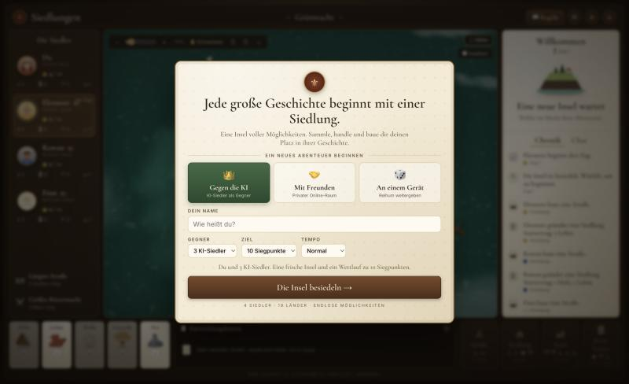
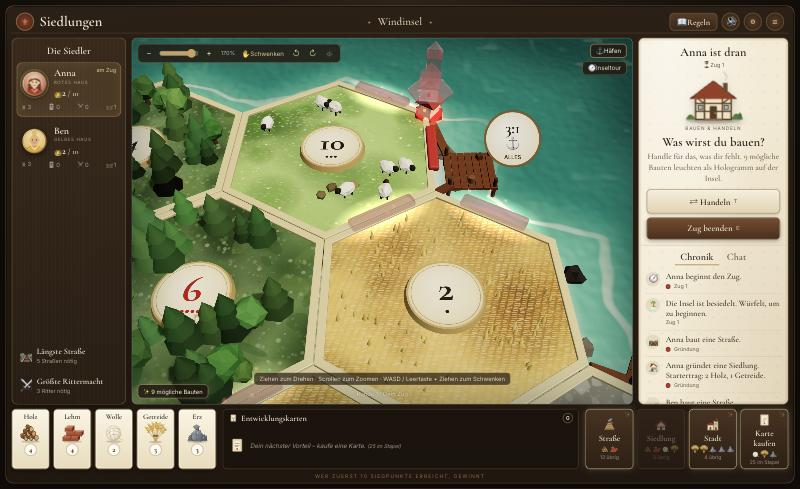
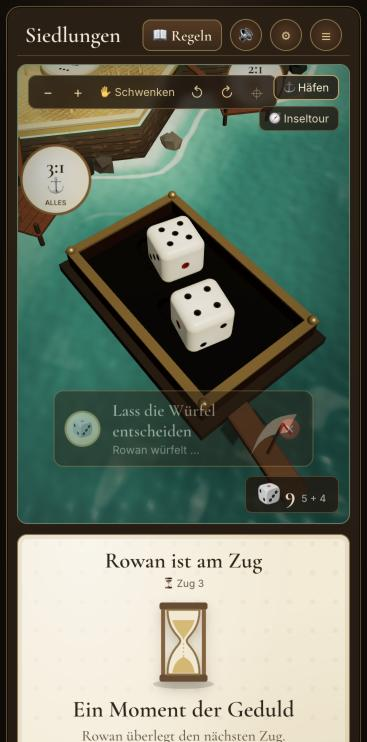
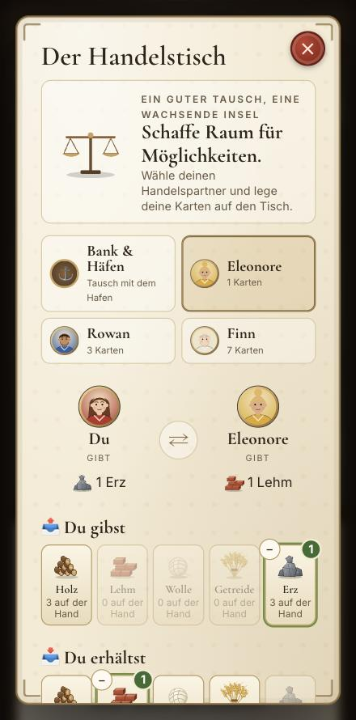

# ⚜ Siedler – das Inselspiel im Browser

Ein liebevoll gestalteter 3D-Nachbau des Brettspiel-Klassikers rund ums Siedeln, Handeln und Bauen – mit Online-Multiplayer, Hot-Seat, KI-Gegnern, Kamerafahrten und einer Hologramm-Bauvorschau. Läuft komplett lokal auf deinem Rechner, Mitspieler verbinden sich einfach über den Browser.



---

## 🚀 Schnellstart

**Voraussetzung:** [Node.js](https://nodejs.org) ab Version 18 (die „LTS“-Version herunterladen und installieren).

| System | So startest du das Spiel |
| --- | --- |
| **macOS** | Doppelklick auf **`start.command`** |
| **Windows** | Doppelklick auf **`start.bat`** |
| **Linux** | Im Terminal: `./start.command` |

Die Startdatei erledigt alles automatisch:

1. prüft, ob Node.js installiert ist,
2. installiert beim ersten Start die Abhängigkeiten,
3. startet den Spielserver und
4. öffnet das Spiel im Browser unter **<http://localhost:5274>**.

Zum Beenden das Terminal-Fenster schließen (oder `Strg + C`). Läuft das Spiel schon, öffnet ein erneuter Doppelklick nur den Browser.

> **macOS-Hinweis:** Beim allerersten Doppelklick kann macOS melden, dass die Datei von einem „nicht verifizierten Entwickler“ stammt. Dann **Rechtsklick → Öffnen → Öffnen** wählen. Falls die Datei nicht ausführbar ist: `chmod +x start.command`.

<details>
<summary>Manuell über das Terminal starten</summary>

```bash
git clone https://github.com/Antonio-Tl/Siedler.git
cd Siedler
npm install
npm start
```

Danach <http://localhost:5274> im Browser öffnen.
</details>

---

## 🎲 Spielmodi



- **Gegen die KI** – du und 1–3 KI-Siedler, Zielpunktzahl (8/10/12) und Tempo frei wählbar.
- **Mit Freunden** – Raum erstellen und den Einladungslink oder den 5-stelligen Code teilen. Freie Plätze füllt der Gastgeber auf Wunsch mit KI-Siedlern.
- **An einem Gerät (Hot-Seat)** – 2–4 Spieler reichen den Bildschirm reihum weiter. Zwischen den Zügen erscheint ein Vorhang, damit niemand fremde Karten sieht.

Jede Partie wird **automatisch gespeichert** – auch über einen Neustart hinweg. Im Menü findest du *„Letzte Partie fortsetzen“* und *„Gespeicherte Partien“*.

### Mit Freunden spielen

- **Im selben WLAN:** Beim Start zeigt das Terminal eine Adresse wie `http://192.168.1.23:5274`. Diese Adresse (mit Raumcode bzw. Einladungslink) an die Mitspieler schicken.
- **Über das Internet:** Am einfachsten [online bei Cloudflare](#online-bei-cloudflare) – dann braucht es keinen eigenen Rechner. Alternativ muss Port 5274 von außen erreichbar sein, z. B. per Portweiterleitung, [Tailscale](https://tailscale.com) oder `ngrok http 5274`.
- **Verbindung verloren?** Einfach neu laden – dein Platz bleibt reserviert. In Online-Partien spielt nach 45 Sekunden eine KI für dich weiter, bis du zurück bist.
- Mehrere Browser-Tabs auf einem Rechner gelten als verschiedene Spieler – praktisch zum Ausprobieren.

### Online bei Cloudflare

Das Spiel läuft auch komplett bei Cloudflare (Workers + Durable Objects, im Gratis-Tarif nutzbar) – ohne eigenen Server und ohne dass dein Rechner an sein muss:

```bash
npm install
npx wrangler login   # einmalig: mit dem Cloudflare-Konto verbinden
npm run cf:deploy    # hochladen – danach unter https://siedlungen.<dein-name>.workers.dev erreichbar
```

Alternativ im Cloudflare-Dashboard unter *Workers & Pages → Erstellen → Repository importieren* dieses Git-Repository verbinden; dann wird bei jedem Push automatisch neu veröffentlicht. Zum lokalen Ausprobieren der Cloudflare-Version: `npm run cf:dev` (Port 8787).

---

## ✨ Auf der Insel



- **Hologramm-Bauvorschau:** Sobald du dir etwas leisten kannst, erscheinen alle möglichen Straßen, Siedlungen und Städte als leuchtende Hologramme in deiner Farbe. Ein Klick genügt zum Bauen – beim Überfahren siehst du Kosten und Erträge.
- **Kamerafahrten:** Beim Würfeln fliegt die Kamera zur Würfelschale, dann zu den Feldern mit Ertrag. Die Felder leuchten auf, Rohstoffe steigen auf und fliegen in deine Hand. Bei einer 7 erwacht der Räuber. Baut ein Mitspieler eine Straße, Siedlung oder Stadt, zeigt die Kamera den neuen Bau.
- **Kamerafahrten abschalten:** Der Knopf **🎥 Kamerafahrten** oben rechts auf dem Brett schaltet alle Fahrten aus; unter ⚙ lassen sich Würfel, Erträge, Räuber und Bauten einzeln an- und abschalten.
- **Lebendige Insel:** Wälder, Schafe, Weizenfelder, Berge, Häfen mit Stegen, Brandung, Wolken und Segelboote. Figuren fallen mit Staubwolke aufs Brett, Straßen wachsen ein, der Räuber hüpft.
- **Geführte Inseltour**, illustriertes **Regelbuch**, **Chronik**, **Chat** und Feuerwerk beim Sieg.

<p>
  
  
</p>

### Steuerung

| Aktion | Maus / Tastatur |
| --- | --- |
| Kamera drehen | Ziehen mit der linken Maustaste |
| Zoomen | Mausrad oder Zoom-Regler |
| Schwenken | `W` `A` `S` `D`, Leertaste + Ziehen oder rechte Maustaste |
| Würfeln | `R` |
| Handelstisch | `T` |
| Zug beenden | `E` |
| Abbrechen / Schließen | `Esc` |

### Einstellungen („An deinem Tisch“ ⚙)

Grafikqualität (Hoch/Mittel/Niedrig), Klang und Lautstärke mit Klangvorschau, Meeresrauschen, Tempo der KI, Kamerafahrten (insgesamt oder einzeln für Würfel, Erträge, Räuber und Bauten), bewegte Szenerie und die Hologramm-Vorschau lassen sich jederzeit anpassen.

Tipp: Ein Klick auf eine Rohstoffkarte in deiner Hand öffnet direkt den Handelstisch mit diesem Rohstoff.

---

## 📜 Regeln (Kurzfassung)

- Zufällige Insel mit 19 Feldern, keine zwei roten Zahlen (6/8) nebeneinander, 9 Häfen (3:1 und 2:1).
- **Gründung:** Jeder setzt zwei Siedlungen mit Straße – in der zweiten Runde rückwärts, die zweite Siedlung bringt Starterträge.
- **Würfeln:** Felder mit der gewürfelten Zahl liefern Rohstoffe an angrenzende Siedlungen (1) und Städte (2).
- **Bei einer 7:** Wer mehr als 7 Karten hat, gibt die Hälfte ab. Der Räuber blockiert ein Feld und stiehlt eine Karte.
- **Bauen:** Straße (Holz, Lehm) · Siedlung (Holz, Lehm, Wolle, Getreide) · Stadt (2 Getreide, 3 Erz) · Entwicklungskarte (Wolle, Getreide, Erz).
- **Entwicklungskarten:** Ritter, Straßenbau, Erfindung, Monopol, Siegpunkt.
- **Handel:** mit der Bank (4:1, an Häfen 3:1 oder 2:1) oder als Angebot an alle Mitspieler. Jeder nimmt an oder lehnt ab; nehmen mehrere an, wählst du, mit wem du tauschst.
- **Sonderpunkte:** Längste Handelsstraße (ab 5) und Größte Rittermacht (ab 3 Rittern) bringen je 2 Punkte.
- Wer in seinem Zug die Zielpunktzahl erreicht, gewinnt.

Das vollständige Regelbuch gibt es im Spiel über **📖 Regeln**.

---

## 🛠 Für Entwickler

```bash
npm install        # Abhängigkeiten
npm start          # Server starten (Port 5274)
npm run dev        # Server mit automatischem Neustart bei Änderungen
npm test           # alle Tests: Regeln, KI-Partien, Online-, Hot-Seat- und Speicher-Tests
npm run cf:dev     # Cloudflare-Version lokal (Wrangler, Port 8787)
npm run cf:deploy  # Cloudflare-Version veröffentlichen
```

| Umgebungsvariable | Bedeutung | Standard |
| --- | --- | --- |
| `PORT` | Port des Servers | `5274` |
| `DATA_DIR` | Ordner für die Spielstände | `./data` |
| `PERSIST` | `0` schaltet das Speichern ab | an |

Beispiel: `PORT=8080 ./start.command` bzw. unter Windows `set PORT=8080` und danach `start.bat`.

### Aufbau

| Pfad | Inhalt |
| --- | --- |
| `start.command` / `start.bat` | Startdateien für macOS/Linux bzw. Windows |
| `shared/engine.js` | Regel-Engine – läuft identisch auf Server und Client |
| `server/lobby.js` | Räume, Lobby, Hot-Seat, Wiederverbinden, Bot-Takt – gemeinsam für Node und Cloudflare |
| `server/index.js` | Node-Server: Express + WebSocket, Speicherstände in `data/rooms.json` |
| `worker/index.js` | Cloudflare-Version: Worker + Durable Object (Speicherstände in dessen SQLite-Datenbank) |
| `wrangler.jsonc`, `scripts/build-cloudflare.js` | Cloudflare-Konfiguration und Build der statischen Dateien nach `dist/` |
| `server/bot.js` | KI-Siedler |
| `client/app.js` | Oberfläche, Menü, Dialoge, Handel, Tour, Kamerafahrten |
| `client/board3d.js` | Three.js-Szene: Kamera, Figuren, Hologramme, Würfel, Effekte |
| `client/three/` | Texturen, 3D-Modelle (Figuren, Räuber, Deko, Häfen) und Wasser |
| `client/art.js` | SVG-Grafiken: Rohstoffe, Porträts, Icons, Illustrationen |
| `test/` | automatisierte Tests |

Der Server ist autoritativ: Alle Spielzüge werden dort geprüft, jeder Spieler bekommt nur seine eigenen Handkarten zu sehen.

---

## ❓ Probleme?

| Problem | Lösung |
| --- | --- |
| „Node.js wurde nicht gefunden“ | Node.js von <https://nodejs.org> installieren und die Startdatei erneut öffnen. |
| „Port schon belegt“ | Ein anderes Programm nutzt Port 5274 – mit `PORT=8080 ./start.command` einen anderen Port wählen. |
| Mitspieler kommen nicht rein | Gleiches WLAN? Firewall-Abfrage beim Start erlaubt? Für Internet-Spiele Port freigeben oder Tunnel nutzen. |
| Spiel ruckelt | Unter ⚙ die Grafikqualität auf „Mittel“ oder „Niedrig“ stellen und ggf. die bewegte Szenerie abschalten. |

---

*Ein nicht-kommerzielles Fanprojekt. Nicht verbunden mit den Rechteinhabern des Originalspiels.*
